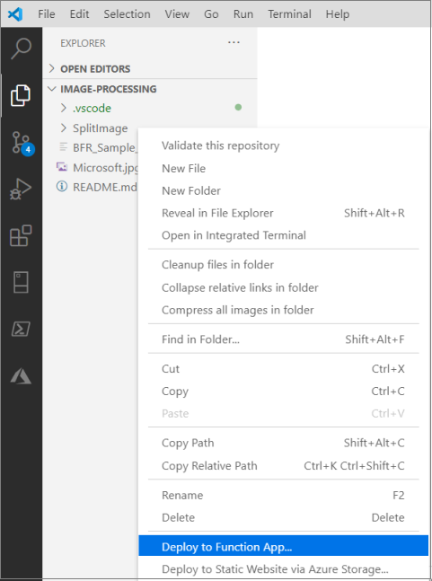

# Image Processing Sample

Cognitive Search can annotate images with text, or images with other images, to create searchable or analyzable text. This sample focuses on a specific aspect of image analysis in a Cognitive Search pipeline: passing images to a custom skill, and return images back to the skillset for further processing.

In this demonstration, you'll use a sample JPEG file, services and tools, and fully formulated requests in a notebook to perform the following tasks:

1. Crack a JPEG file from Blob Storage and scrape the image for text, using the [Optical Character Recognition (OCR) skill](https://docs.microsoft.com/azure/search/cognitive-search-skill-ocr) in Cognitive Search.
1. Analyze the resulting text for personal information, such as phone numbers, using the [PII skill](https://docs.microsoft.com/azure/search/cognitive-search-skill-pii-detection).
1. Split the text into smaller units and blur the units that contain phone numbers. Use a [custom skill](https://docs.microsoft.com/azure/search/cognitive-search-custom-skill-web-api) for this task.
1. Reconstitute the image in Blob storage. Use the [TextMerge skill](https://docs.microsoft.com/azure/search/cognitive-search-skill-textmerger) for this step.

Post-OCR, the skillset runs the extracted text through the PII detection skill to identify personal information (phone numbers). The custom skill then obfuscates the phone numbers by accepting as inputs the image, the layout text from  OCR step, and the identified personal information. Output of the custom skill is the image with obfuscated sections. The output is then returned to the skillset and projected to the knowledge store.

The source input and resulting output are stored in Azure Blob Storage, so you will need a storage account to run this sample.

Predefined skills, such as OCR skill, are backed by Cognitive Services. You will need the Cognitive Services account name for this tutorial, but because the number of transformations is limited, there is no charge to your account.

Custom skills must be hosted as a URL-accessible module. This tutorial uses Azure Functions to satisfy this requirement, but you could use another mechanism for your own solutions.

In this sample, skillset output is sent to a [knowledge store](https://docs.microsoft.com/azure/search/knowledge-store-concept-intro) in Azure Storage. Because knowledge store is not yet supported in the [**azure-search-documents**](https://docs.microsoft.com/python/api/overview/azure/search-documents-readme) python library, the [Search REST APIs](https://docs.microsoft.com/rest/api/searchservice/) are used instead.

## Prerequisites

+ [Azure subscription](https://Azure.Microsoft.com/subscription/free)
+ [Azure Cognitive Search](https://docs.microsoft.com/azure/search/search-create-service-portal)
+ [Azure Storage](https://docs.microsoft.com/azure/storage/common/storage-account-create)
+ [Azure Cognitive Services](https://docs.microsoft.com/azure/cognitive-services/cognitive-services-apis-create-account)
+ [Python 3.6+](https://www.python.org/downloads/)
+ [Visual Studio Code](https://code.visualstudio.com/download) with the [Azure Functions extension](https://marketplace.visualstudio.com/items?itemName=ms-azuretools.vscode-azurefunctions) and the [Python extension](https://marketplace.visualstudio.com/items?itemName=ms-python.python)

## Set up your project

Before you can run the sample, assemble the resources that are referenced by the skillset.

1. Download the **azure-search-python-samples** repository and extract its contents. 

1. Open the **image-processing** sample folder to find the files used in this sample.

### In Azure portal

1. Go to your Azure Storage account and set up the data source:
   1. Create a container named "bfr-sample".
   1. Upload the sample JPEG file (microsoft.jpg) from the sample folder.
   1. From **Access keys**, copy the Azure Storage connection string and paste it into NotePad.

1. Go to your search service, copy the search endpoint (http://<SERVICE-NAME>.search.windows.net) and an admin API key.

1. Create a function app. Default values work for this sample. Be sure to choose Python for the run time stack. In the next step, you'll choose this app when deploying the custom skill. 

   

### In Visual Studio Code

Set up the function app that contains the custom code.

1. In Visual Studio Code, navigate to the **image-processing** sample folder.

1. Right-click the **SplitImage** folder and select **Deploy to Function App**. You'll be prompted to select the function app you created in the previous step. You might also be prompted to sign in to Azure if you're not already.

   

1. Monitor notifications in the Output window (**View** > **Output**) for a "Deployment successful" message.

1. Still in Visual Studio Code, switch to **Azure** explorer.

1. Open **Resources**, your subscription folder, **Function App**, and find the app you just deployed.

   

1. In the Functions folder, right-click **ImageSkill HTTP**, and then copy the function URL. Save it in Notepad.

   

## Run the Python code in the notebook

1. Open the BFR_Sample_Rest.ipynb file in Jupyter Notebook.

1. In the first cell, replace the following placeholders with the values you found or created in the previous step:

   + search service endpoint
   + search service admin API key
   + Azure Storage connection string
   + Blob container that contains the JPEG
   + Function app URL

1. Run each cell individually or select **Run all**.

## Validation

Once the indexer completes, use the Azure portal and Storage explorer in your Azure Storage account to find the final output. You will see a container named `kstore-obfuscated` in Azure Storage that contains the same image you started with, but with the phone number redacted. For comparison, the original image is stored in a container `images`.
